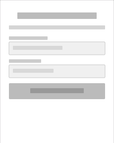
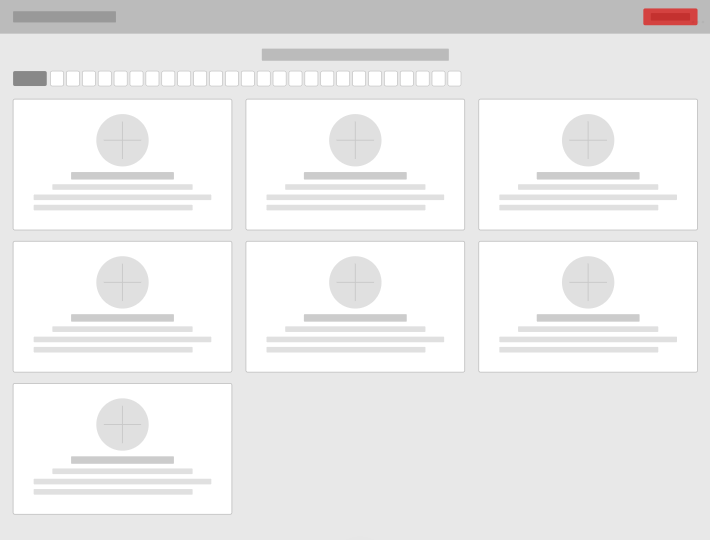
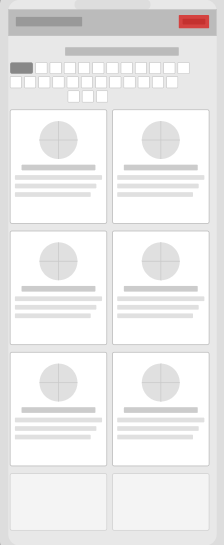
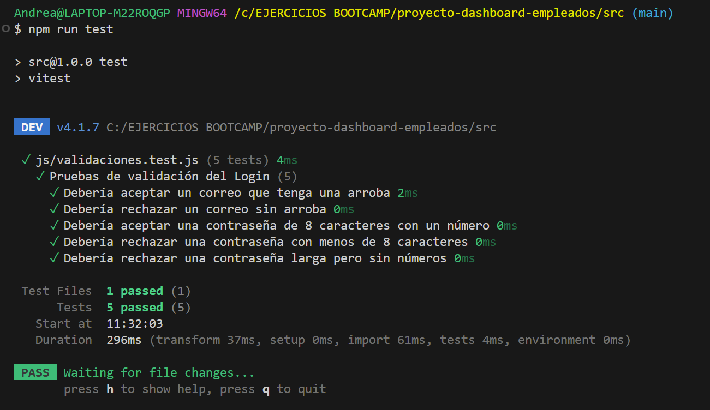
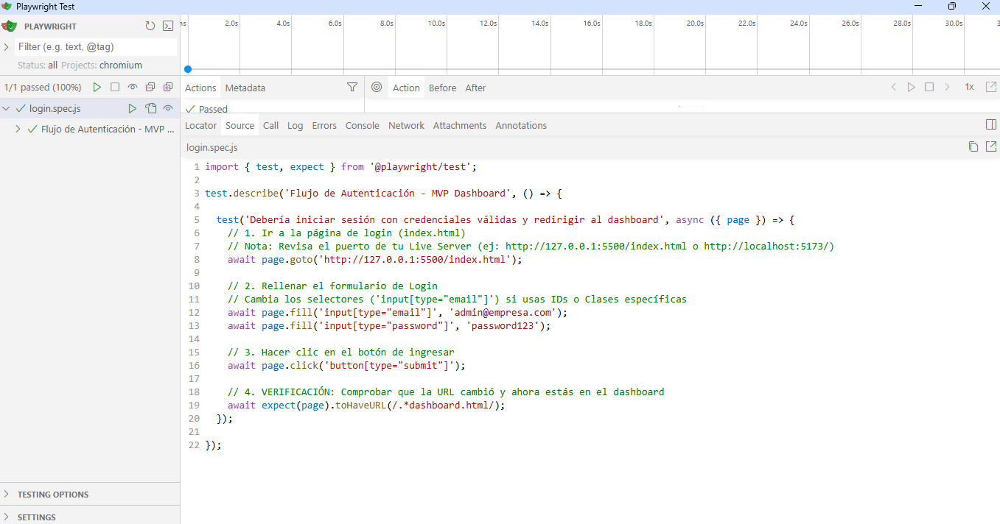
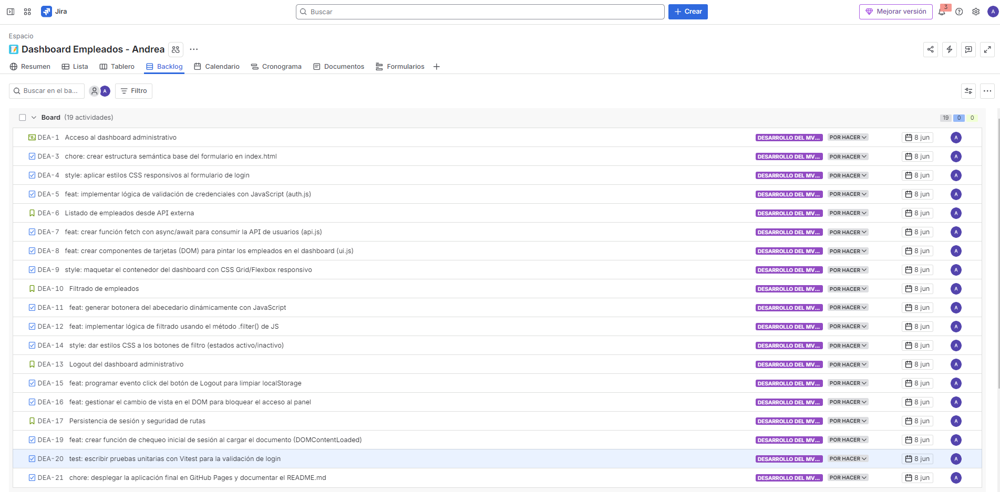

# 📊 Dashboard Administrativo de Gestión de Empleados

## 📝 Descripción del Proyecto
Esta aplicación es un panel de administración dinámico y modular desarrollado íntegramente con **JavaScript Vanilla** y estilizado con **Tailwind CSS**. Permite a un usuario administrador autenticarse de forma segura mediante reglas estrictas de validación, visualizar un listado detallado de empleados consumido en tiempo real desde una API REST externa, realizar filtrados interactivos por la inicial del nombre y gestionar de forma segura el ciclo de vida de la sesión mediante almacenamiento local (`localStorage`).

---

## 🛠️ Tecnologías y Herramientas
* **Diseño y Prototipado:** Lovable, Figma & Stitch (Generación ágil de la interfaz, wireframes y flujo interactivo del sistema).
* **Tecnologías Core:** HTML5 Semántico y JavaScript Vanilla (ES6+).
* **Estilos y Maquetación:** Tailwind CSS (Framework de CSS utilitario para un diseño ágil, responsivo y adaptativo mediante Flexbox y CSS Grid).
* **Entorno de Testing:** Vitest para la ejecución automatizada de pruebas unitarias de lógica de negocio y Playwright para pruebas End-to-End (E2E).
* **Control de Versiones:** Git bajo la metodología de *Conventional Commits* alojado en GitHub.
* **Gestión del Proyecto:** Jira Software (Metodología Agile/Scrum).

---

## 🎨 Prototipo, Despliegue y Userflow
* **Enlace al Prototipo en Lovable:** [Haz clic aquí para acceder al prototipo interactivo en Lovable](https://id-preview-9b0ab2ae--91be1556-9d41-4a82-b07e-bdb22bd2371c.lovable.app/login)
* **Enlace del Despliegue en Producción (GitHub Pages):** 👉 [Haz clic aquí para ver la aplicación en producción](https://andreavago.github.io/proyecto-dashboard-empleados/)

---

## 📐 Wireframes (Diseño Adaptivo)
La estructura y distribución visual de la aplicación se planificó bajo un enfoque de diseño minimalista de baja fidelidad (*wireframing* de alta abstracción), proyectando el comportamiento de la interfaz de forma completamente responsiva tanto para entornos de escritorio como para dispositivos móviles:

### 🔐 1. Pantalla de Login (`index.html`)
Su estructura plantea una distribución limpia con un contenedor simétrico centrado que optimiza la concentración del usuario en el formulario de acceso.

* **Vista Desktop (Escritorio):**
  

* **Vista Mobile (Móvil):**
  

---

### 📊 2. Panel de Administración (`dashboard.html`)
Diseño modular basado en rejillas dinámicas (CSS Grid y Flexbox) que priorizan la jerarquía de la barra de acciones superior, la botonera de filtrado alfabético unificado (A-Z) y la disposición fluida de las tarjetas de empleados.

* **Vista Desktop (Escritorio):**
  

* **Vista Mobile (Móvil):**
  

---
## 🔄 Flujo de Usuario (Userflow)

El sistema cuenta con dos estados principales: el flujo de acceso (público) y el panel de administración (privado), protegidos mediante el estado de la sesión en el almacenamiento local.

### 🗺️ Diagrama Visual del Flujo
A continuación se detalla gráficamente el comportamiento de la aplicación según el estado de autenticación del usuario y las interacciones disponibles:

[ INICIO ]
   │
   ▼
¿Existe la sesión activa en el navegador? (localStorage: 'usuarioLogueado')
   │
   ├───► SÍ ───► [ REDIRECCIÓN AUTOMÁTICA ] ───► (Saltar a zona DASHBOARD)
   │
   └───► NO
         │
         ▼
[ PÁGINA DE LOGIN (index.html) ]
         │
         ▼
El usuario rellena el formulario (Email y Contraseña)
         │
         ▼
[ EVENTO: Click en botón "Ingresar" ]
         │
         ▼
¿Cumple las reglas de validación?
• Email contiene '@'
• Contraseña >= 8 caracteres y mínimo 1 número
         │
         ├───► NO ───► [ MOSTRAR ERROR EN PANTALLA ] ──► (Permanece en Login)
         │
         └───► SÍ
               │
               ▼
   [ REGISTRAR SESIÓN ] ───► Guarda el estado en localStorage
               │
               ▼
   [ REDIRECCIÓN ] ───► Envía al usuario a 'dashboard.html'
               │
               └─────────────────────────┐
                                         │
                                         ▼
                       [ PANEL PRIVADO (dashboard.html) ]
                                         │
                                         ▼
                     [ CONTROL DE SEGURIDAD (HU-05) ]
                     ¿Viene con sesión válida en localStorage?
                                         │
                                         ├───► NO ───► [ REDIRECCIÓN FORZOSA ] ──► (Vuelve a index.html)
                                         │
                                         └───► SÍ
                                               │
                                               ├─► [ PETICIÓN HTTP (Fetch) ] ──► Consume JSONPlaceholder (/users)
                                               │                                         │
                                               │                                         ▼
                                               │                               [ RENDERIZAR EMPLEADOS ]
                                               │                                Muestra las tarjetas con 
                                               │                                Datos, Dirección y Avatar
                                               │
                                               ├─► [ INTERACCIÓN DE FILTRADO ] 
                                               │    Click en Botonera Alfabética ──► Filtra array por inicial
                                               │                                         │
                                               │                                         ▼
                                               │                               [ ACTUALIZAR REJILLA DOM ]
                                               │
                                               └─► [ EVENTO: CERRAR SESIÓN ]
                                                    Click en botón "Logout"
                                                         │
                                                         ▼
                                               [ LIMPIAR LOCALSTORAGE ]
                                                         │
                                                         ▼
                                               [ REDIRECCIÓN AL LOGIN ] ──► Envía de vuelta a 'index.html'

### 📝 Explicación del Proceso Paso a Paso

1. **Control de Entrada (Filtro de Autenticación):**
   * El usuario entra a la aplicación. El script comprueba de inmediato si existe la clave `usuarioLogueado` en el `localStorage`.
   * Si existe, el usuario es redirigido de forma automática a `dashboard.html` sin pasar por el formulario de acceso.

2. **Formulario de Login (index.html):**
   * Si no hay sesión previa, el usuario introduce su correo y contraseña en la interfaz.
   * Al hacer clic en "Ingresar", el sistema ejecuta las validaciones en el frontend: el formato de correo electrónico debe contener un patrón válido con `@`, y la contraseña debe poseer un tamaño mínimo de 8 caracteres junto con al menos un dígito numérico.
   * **Credenciales incorrectas:** Se inyecta un mensaje de error dinámico en el DOM y se bloquea la navegación.
   * **Credenciales correctas:** Se almacena de forma persistentente el token de estado en el `localStorage` y se activa la redirección.

3. **Panel Administrativo (dashboard.html):**
   * Al inicializarse la vista del panel, se despacha una petición asíncrona mediante `fetch` hacia el endpoint de la API REST externa `https://jsonplaceholder.typicode.com/users`.
   * El archivo JSON recibido se procesa dinámicamente mapeando de forma obligatoria los atributos `name`, `email` y las propiedades internas de dirección (`street`, `suite`, `city` y `zipcode`) junto con un avatar representativo.

4. **Interacción y Filtrado:**
   * El administrador puede interactuar con una botonera alfabética completa (A-Z) integrada en la cabecera o seleccionar el botón "Todos" para restablecer la vista completa. Al capturar el evento de selección, la aplicación filtra la colección de datos original evaluando la inicial de la propiedad `name`, redibujando la rejilla de tarjetas en tiempo real de forma reactiva o mostrando un mensaje informativo si no existen coincidencias.

5. **Cierre de Sesión (Logout):**
   * Al accionar el botón de deslogueo, se destruye el registro guardado en el almacenamiento local y se fuerza el retorno hacia `index.html`, restringiendo por completo cualquier intento de reingreso por manipulación directa de la URL.

---

## 📈 Historial de Desarrollo y Control de Versiones (Git)
El proyecto se ha desarrollado siguiendo la convención internacional de **Conventional Commits**, garantizando un historial de desarrollo atómico, limpio y profesional:

* `refactor: estructurar wireframes adaptivos en versiones desktop y mobile` -> Sustitución de los esquemas visuales anteriores por diseños de baja fidelidad simplificados y adaptados a dispositivos móviles.
* `refactor: ampliar botonera de filtros de la A a la Z y unificar lógica del DOM` -> Optimización del filtrado alfabético para abarcar el abecedario completo, inclusión del botón de restauración "Todos" y control de estados vacíos.
* `docs: diseñar diagrama visual de flujo de usuario y mapeo paso a paso` -> Incorporación del mapa de navegación interactivo (Userflow) detallando el ciclo de vida de la sesión en el almacenamiento local.
* `docs: corregir errores y actualizar evidencias en el readme` -> Ajustes finales en la documentación, corrección de erratas e inclusión de las capturas de Playwright.
* `test: implementar caso de prueba E2E con Playwright para el flujo de login` -> Automatización de la verificación de acceso y redirección correcta al dashboard.
* `docs: integrar la HU-05 de seguridad y control de acceso en el readme` -> Sincronización de la quinta historia de usuario y actualización de la documentación del repositorio.
* `docs: actualizar readme y añadir wireframes de las vistas` -> Sincronización final de la documentación con las capturas de diseño y optimización de contenido.
* `docs: actualizar entregables con enlaces definitivos de lovable y github pages` -> Configuración y enlace a los entornos estables de producción en la nube.
* `docs: guardar avance del README estructurado y correcciones de diseño en el dashboard` -> Registro del progreso de la estructura del documento guía del proyecto.
* `style: adaptar selectores a etiquetas nativas, centrar titulo y alinear cabecera` -> Limpieza y optimización visual del diseño del panel administrativo.
* `fix: corregir ruta del script, añadir type module e implementar redireccion del login al dashboard` -> Resolución del bug de enrutamiento y cambio hacia módulos nativos de JS.
* `docs: añadir .gitignore y captura de pantalla de vitest en assets` -> Inclusión de configuraciones de exclusión de ficheros y almacenamiento de evidencias técnicas.
* `test: implementar pruebas unitarias con vitest para la validacion del login` -> Desarrollo de la suite de tests automatizados para validar correos y contraseñas seguras.
* `feat: lógica de filtros por letra y comentarios explicativos completados` -> Renderizado dinámico de la botonera alfabética y captura del evento de filtrado en el DOM.
* `docs: añadir comentarios explicativos en login, api y dashboard` -> Incorporación de documentación interna del código fuente para mejorar el mantenimiento.
* `feat: implementar boton de cerrar sesion en el dashboard` -> Gestión del ciclo de vida de la sesión mediante el borrado controlado del almacenamiento local.
* `feat: estructura inicial del dashboard y configuracion de la api` -> Implementación de la petición asíncrona con fetch y mapeo de los datos del personal.
* `feat: implementar logica de validacion de credenciales en auth.js` -> Captura y procesamiento de las reglas del formulario de acceso.
* `style: implementar diseño responsivo y estilos globales con Tailwind CSS` -> Configuración del framework e integración de clases utilitarias para la interfaz.
* `feat: estructura semantica inicial del formulario de login en index.html` -> Maquetación base de la vista de acceso empleando etiquetas accesibles de HTML5.
---

## 🧪 Evidencias de Testing

### 🟢 Pruebas Unitarias (Vitest)
Se han diseñado e implementado pruebas unitarias destinadas a blindar la seguridad del acceso analizando la validación de strings para correos y contraseñas seguras:

### 🎭 Pruebas End-to-End (Playwright)
Se ha automatizado el flujo completo de usuario de manera real empleando Playwright, simulando la carga del login, la inserción de credenciales, el clic de envío y verificando la redirección exitosa al panel privado:

---

## 📅 Planificación del Proyecto (Jira)
El ciclo de vida del desarrollo se ha gestionado empleando metodologías ágiles a través de la herramienta **Jira Software**, organizando los requerimientos funcionales en historias de usuario estimadas con sus respectivas fechas de inicio y vencimiento dentro del Sprint de la semana.

* **Evidencia del Tablero de Jira:**

---

## 👤 Historias de Usuario y Criterios de Aceptación

### HU-01: Acceso Seguro al Dashboard
* **Como:** Usuario administrador.
* **Quiero:** Un sistema de autenticación por email y contraseña.
* **Para:** Restringir el panel exclusivamente a personal autorizado.
* **Criterios de Aceptación:** Email con formato válido (`@`). Contraseña obligatoria de al menos 8 caracteres con mínimo un número. Redirección automática y persistencia inmediata en el navegador mediante `localStorage`.

### HU-02: Consumo de Datos de Empleados
* **Como:** Administrador autenticado.
* **Quiero:** Visualizar una galería con los datos de los empleados de la empresa.
* **Para:** Consultar su información de contacto de forma centralizada.
* **Criterios de Aceptación:** Consumo estable de la API REST externa de JSONPlaceholder (`/users`). Mapeo y renderizado dinámico en el DOM de Avatar, Name, Email y la dirección completa concatenando `street`, `suite`, `city` y `zipcode`.

### HU-03: Filtrado Dinámico de Personal
* **Como:** Administrador autenticado.
* **Quiero:** Filtrar a los empleados por la primera letra de su nombre.
* **Para:** Agilizar las búsquedas operativas diarias.
* **Criterios de Aceptación:** Botonera interactiva con el abecedario completo (A-Z) y opción para restablecer ("Todos"). Al pulsar una letra, la rejilla del DOM se actualiza en tiempo real de forma reactiva sin recargar la página. Si no existen coincidencias con la inicial seleccionada, la aplicación debe mostrar un mensaje informativo indicando la ausencia de registros.

### HU-04: Cierre de Sesión Seguro (Logout)
* **Como:** Administrador autenticado.
* **Quiero:** Disponer de una opción clara para cerrar mi sesión en la cabecera.
* **Para:** Revocar los permisos de acceso al abandonar el equipo de trabajo.
* **Criterios de Aceptación:** Botón dedicado que limpia las claves de sesión del almacenamiento local y redirige de manera forzosa al usuario al portal de login, bloqueando el reingreso directo por URL.

### HU-05: Control de Acceso y Redirección de Seguridad
* **Como:** Administrador del sistema.
* **Quiero:** Que la aplicación impida el acceso directo al panel privado si no existe una sesión activa en el navegador.
* **Para:** Proteger la confidencialidad de los datos del personal y evitar accesos no autorizados a través de la URL.
* **Criterios de Aceptación:** Al inicializarse el archivo `dashboard.html`, se evalúa mediante una estructura condicional la existencia de la clave de usuario en el `localStorage`. En caso de que el almacenamiento local se encuentre vacío, la aplicación intercepta la carga y ejecuta una redirección forzosa e inmediata hacia la pantalla de login principal (`index.html`).

---

## ✍️ Autor
* **Andrea** - Full Stack Developer